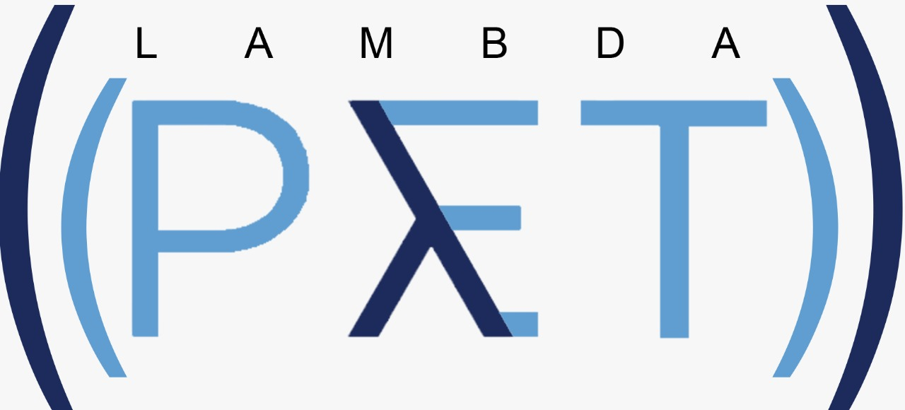

# (λ (PET))

Grupo de discução sobre linguagens funcionais

## Peso dos participantes

* Daniel 100kg
* Edival 93.5kg
* Pablo 76.5kg
* Mulling 85kg
* Marcos 107kg
* Nunes 100kg

## Regras
1 -  Todos os commits do projeto devem conter o peso atual do participante.

## Projetos

[LambdaIO](https://github.com/Daniel-Boll/LambdaIO)

[Interpretador de LISP em Haskell](https://github.com/Mulling/meta)

[Avaliador e analisador de fórmulas lógicas em Haskell](https://github.com/Tomcat-42/haskell-tautology-checker)
