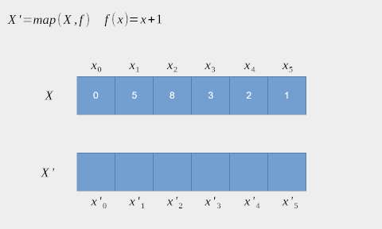
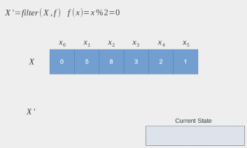

# Exercícios feitos no dia 14/10/2019
encontro número 2.

---

### Crie uma função que dado um valor x e um valor y retorne uma lista contendo todos os elementos entre o intervalo x y.

```scheme
(define (range l h)
  (if (> l h)
      '()
      (cons l (range (1+ l) h))))
```

---

### Crie uma função que dada uma lista 'l' retorne uma lista com o incremento dos valores armazenados em 'l'.

```scheme
(define (inc-list l)
  (if (null? l)
      '()
      (cons (1+ (car l))
            (inc-list (cdr l)))))
```

  * Generalize a função acima para aplicar qualquer função em todos os
    elementos de uma lista retornando uma lista formada pelo resultado
    da aplicação desta função em cada elemento.

    

```scheme
(define (my-map fn l)
  (if (null? l)
      '()
      (cons (fn (car l))
            (my-map fn (cdr l)))))
```

---

### Crie uma função que dado uma lista 'l' realize a soma de todos os elementos de 'l'

```scheme
(define (sum-list l)
  (if (null? (cdr l))
      (car l)
      (sum-list (cons (+ (car l) (car (cdr l)))
                      (cdr (cdr l))))))
```

  * Generalize a função acima para qualquer operação (função)

```scheme
(define (my-fold-l fn acc lst)
  (if (null? lst)
      acc
      (my-fold-l fn (fn acc (car lst)) (cdr lst))))
```

```scheme
(define (my-fold-r fn acc lst)
  (if (null? (cdr lst))
      (fn (car lst) acc)
      (fn (car lst) (my-fold-r fn acc (cdr lst)))))
```

  * Utilizando fold compute o fatorial de uma lista

```scheme
(my-fold-l (lambda (x y)
             (* x y))
           1
           (range 1 5))
```

  * Utilizando fold filtre uma lista
  - OPEN:

---

### Crie uma funçao que dado uma lista 'l' retorne uma lista formada apenas pelos números positivos contidos em 'l'

```scheme
(define (filter-pos l)
  (if (null? l)
      '()
      (if (> (car l) 0)
          (cons (car l) (filter-pos (cdr l)))
          (filter-pos (cdr l)))))
```
  * Generalize para qualquer operação

    

```scheme
(define (my-filter fn l)
  (if (null? l)
      '()
      (if (fn (car l))
          (cons (car l) (my-filter fn (cdr l)))
          (my-filter fn (cdr l)))))
```

  * Implemente o quicksort

```scheme
(define (qsort l)
  (if (null? l)
      '()
      (append (qsort (my-filter (lambda (x)
                                  (<= x (car l)))
                                (cdr l)))
              (list (car l))
              (qsort (my-filter (lambda (x)
                                  (> x (car l)))
                                (cdr l))))))
```

  * Implemente quicksort usando fold ao invez de filter
  - OPEN:

  * Implemente o merge sort
  - OPEN:

---
